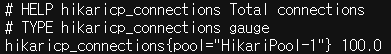
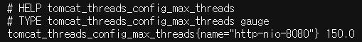
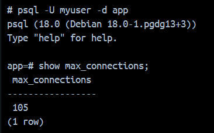

## 설치 및 실행

### 도커(cAdvisor, PostgreSQL, Prometheus, Spring Boot)
루트 디렉토리에 있는 `template.env`의 값을 설정하고 파일명을 `.env`로 변경합니다.

```
APP_CONNECTION_POOL_SIZE=<커넥션 풀 크기>
APP_THREAD_POOL_SIZE=<스레드 풀 크기>

# APP_CONNECTION_POOL_SIZE보다 5이상 크게 설정
POSTGRES_POOL_SIZE=<커넥션 풀 크기 + 5>

# ...
```
   
값을 지장한 뒤 Docker Desktop 실행 후 루트 디렉토리에서 컨테이너를 실행합니다.

```bash
docker compose up -d
```

각 설정값은 다음을 통해 확인할 수 있습니다.

1. Hikari 커넥션 풀 크기
   `http://localhost:8080/actuator/prometheus`에서 `hikaricp_connections` 검색

   

2. 스레드 풀 크기
   `http://localhost:8080/actuator/prometheus`에서 `tomcat_threads_config_max_threads` 검색



3. PostgreSQL 최대 커넥션 크기
   postgres 컨테이너 접속 후
   
   ```
   psql -U myuser -d app
   show max_connections;
   ```

   

실험에서는 본인의 로컬에 설치되어있던 Prometheus를 사용하였고 Spring Boot 어플리케이션을 직접 실행하였으나, 리포지토리는 재현 편의성을 위해 도커를 사용합니다.

### k6
[k6 다운로드 링크](https://grafana.com/docs/k6/latest/set-up/install-k6/)를 참고하여 설치합니다.

## 테스트 진행

1. `.env` 및 `test.js` 설정
   `.env` 파일에서 커넥션 풀 및 스레드 풀을 설정합니다. 또한 `test.js`에서 최하단 `options` 객체의 `rate` 값(RPS)을 설정합니다.

2. 컨테이너 실행
   `docker compose up -d`를 통해 컨테이너를 실행합니다.

3. 스크립트 실행
   윈도우의 경우 제공된 PowerShell 스크립트를 통해 결과를 한 번에 확인할 수 있습니다. 다만 환경에 따라 Prometheus 쿼리 결과의 형태가 다를 수 있어, 먼저 `localhost:9090`에 접속해 스크립트의 쿼리를 실행해보는 것을 권장합니다.
   
   PowerShell을 실행하고 스크립트가 있는 폴더로 이동한 뒤, 스크립트 파일을 실행합니다. 
   
   ```PowerShell
   ./metric_test.ps1
   ```
   "cannot be loaded because running scripts is disabled on this system."와 같은 스크립트 실행 권한 오류가 발생하면 다음 명령으로 실행 권한을 설정해줍니다.
   
   ```
   Set-ExecutionPolicy -ExecutionPolicy Unrestricted -Scope CurrentUser
   ```
   
   스크립트의 대략적인 구조는 다음과 같습니다. 다른 OS 환경에서 작동 시 참고하세요.
   1. 시작 시각 기록
   2. k6 테스트 시작
   3. 종료 시각 기록
   4. 5초 대기
   5. 시작 시각부터 종료 시각 +3초까지의 메트릭 측정
   
4. 컨테이너 종료
   `docker compose down -v`를 통해 환경을 초기화합니다.